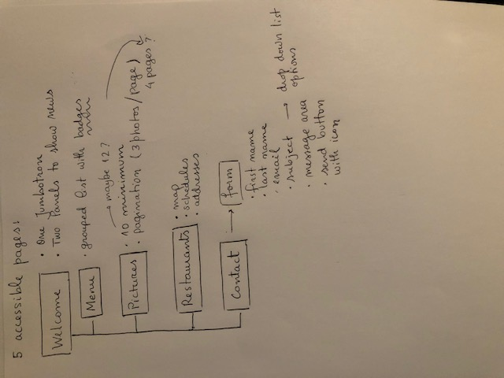
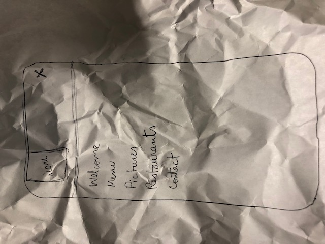

# restaurant-css-framework
######  This project consists of building a website for a hypothetical restaurant, with the goal of getting familiar with the bootstrap framework.
 
### Planning the project

I have started by making a scheme of what was asked.

The first thing to do was to come up with a design. It was time to let my creativity run free!

After 3 hours and dozens of paper sheets, this was what I had.

### Planing the project part 2
I have decided to change my approach and quit the design part. Given that, at this point, my creativity levels are below zero, I have put my focus on the following 
bootstrap grid exercise:

That would be the starting point for the layout of my webpage. 

This was my result:

Unfortunately, I don't have a screenshot for the desktop layout, but it is responsive! :pray:

### Diving headfirst into the project
Having a layout for the first page, my next goal was to do the same for all pages, and to connect them. I've coded the navigation section and made sure it was responsive and that all links worked. I sounds it was easy, but it wasn't.

#### Name

Meanwhile, I had to come up with a name. The first thing that came into my mind was my mom's name. Having so much work to do, I though that was good enough. 

#### Logo
The next step was the logo. I've searched and found **FreeLogoDesign** (https://fr.freelogodesign.org/).

This was the result:

#### Work work work
Then I've focused on the elements that needed to be included in our page and I've been working in small steps, with the help of bootstrap documentation and some videos on youtube.

#### Put everything on GitHub
I know. 

[GitHub page](https://sarabrzn.github.io/restaurant-css-framework/)

